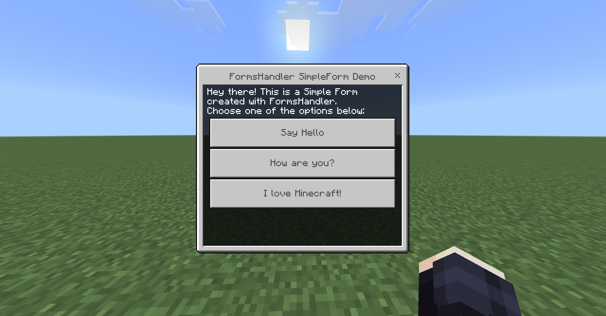
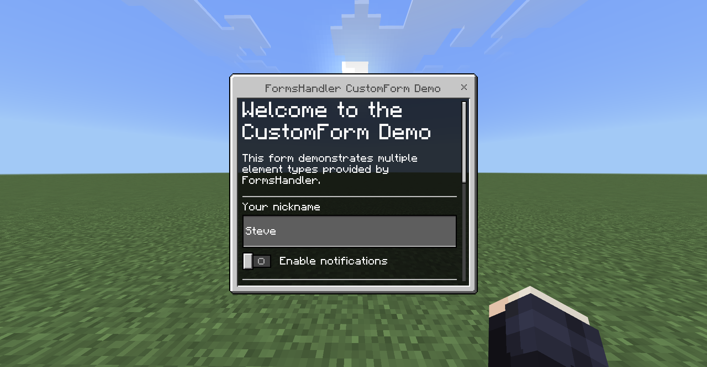
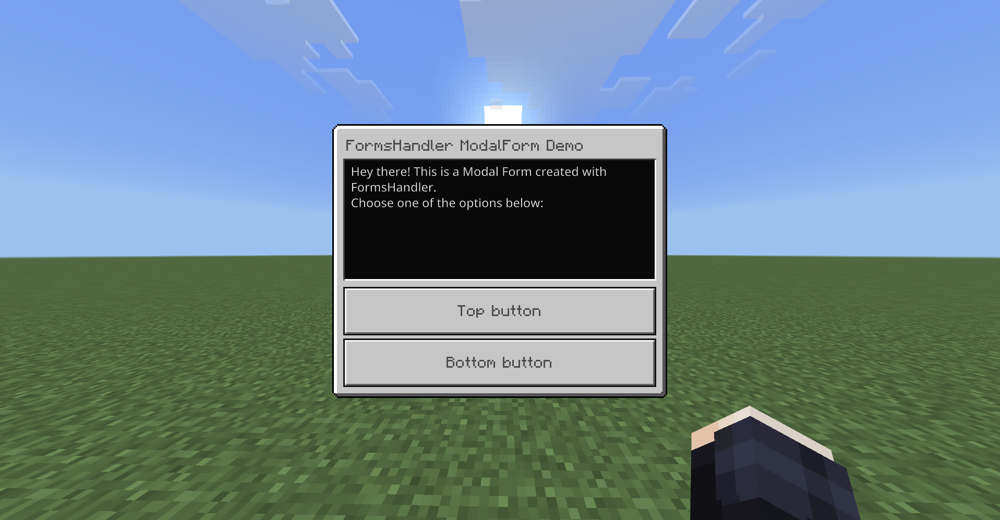

# FormsHandler


**FormsHandler** is a **PocketMine-MP plugin** that completely **redefines how forms are handled** and managed on your server.  

PocketMine forms are poorly implemented ; allowing players to **move, open inventories, or interact** while a form is open, and even **respond to forms after closing them**.

It solves all of these issues by providing a **robust, secure, and extensible form management system** designed for reliability.

FormsHandler also includes an **optional JSON-UI texture pack** that enhances the visual presentation of Simple Forms, allowing for headers, labels, and dividers to **be displayed between buttons**.

# Overview

FormsHandler gives you **full control over the form lifecycle** through a secure and state-aware management layer:
- **Automatic form closing** when a player moves, interacts, or performs actions **while a form is open**
- **Smart validation** ensures responses are only accepted when the form is active and the player is connected
- Prevents players from **responding to old or invalid forms**, closing them automatically **if inconsistencies are detected**

Additionally, FormsHandler provides a **clean and fluent API**, making form creation **elegant, safe, and easy** for all types of forms.

While FormsHandler is **designed to work best with forms created using its own API**, it can also handle forms **not built** through FormsHandler.

However, these external forms have limited support and functionality, especially for Simple Forms:
- It’s not possible to distinguish between **a form being closed** and a **button being clicked** (you have to do it yourself)
- **UI enhancements** for Simple Forms such as headers, labels, or dividers **are not available**

For the **best experience including** full validation and enhanced UI, it’s **strongly recommended** to create forms **through the FormsHandler API**.

# Features

## Project TODO Progress

- [x] Base implementation of SimpleForm, CustomForm, and ModalForm classes
- [x] Automatically closes forms when a player attempt forbidden actions (movement, inventory use, etc.)
- [x] Ensures that only responses from the currently active form are processed
- [x] Accepts external (non-FormsHandler) forms with limited functionality
- [x] Logging for form anomalies
- [x] Adds headers, dividers, and labels in Custom Forms
- [ ] Adds headers, dividers, and labels between buttons in Simple Forms via the optional JSON-UI texture pack
- [ ] Configurable rules

### Notes

> The optional UI enhancement pack for Simple Forms has not been created yet, it will be added in the future.

## Clean and Expressive API

Form creation becomes simple and readable.

Supported form types:
- **Simple Form**
- **Custom Form**
- **Modal Form**

### Simple Form

Without visual elements:
```php
use pocketmine\player\Player;
use FormsHandler\elements\simpleform\Button;
use FormsHandler\types\SimpleForm;

// Create a new SimpleForm
$form = (new SimpleForm())
    ->setTitle("FormsHandler SimpleForm Demo")
    ->setContent("Hey there! This is a Simple Form created with FormsHandler.\nChoose one of the options below:")
    ->addButton(new Button("Say Hello"))
    ->addButton(new Button("How are you?"))
    ->addButton(new Button("I love Minecraft!"))
    ->onSubmit(function(Player $player, mixed $response) {
        $player->sendMessage("You selected option #$response!");
    })
    ->onClose(function(Player $player) {
        $player->sendMessage("You closed the form.");
    });

// Send the form to the player
$player->sendForm($form);
```

Preview:


### Custom Form

```php
use pocketmine\player\Player;
use FormsHandler\types\CustomForm;
use FormsHandler\elements\customform\{
    Input,
    Toggle,
    Dropdown,
    Slider,
    StepSlider,
    Label
};

// Create a new CustomForm
$form = (new CustomForm())
    ->setTitle("FormsHandler CustomForm Demo")
    ->addHeader("Welcome to the CustomForm Demo")
    ->addLabel("Hey there! This is a Custom Form created with FormsHandler.\nThis form demonstrates multiple element types provided by FormsHandler.")
    ->addDivider()

    ->addElement(new Input("Your nickname", "Enter your name...", "Steve"))
    ->addElement(new Toggle("Enable notifications"))
    ->addDivider()

    ->addHeader("Preferences")
    ->addElement(new Dropdown("Choose your favorite block", ["Grass Block", "Diamond Block", "TNT", "Crafting Table"]))
    ->addElement(new Slider("Select your skill level", 1, 10, 1, 5))
    ->addElement(new StepSlider("Pick a difficulty", ["Peaceful","Easy","Normal","Hard"]))
    ->addDivider()
    ->addLabel("End of form")

    ->onSubmit(function(Player $player, array $response) {
        // ...
    })
    ->onClose(function(Player $player) {
        $player->sendMessage("You closed the form.");
    });

// Send the form to the player
$player->sendForm($form);
```

Preview:


### Modal Form

```php
use pocketmine\player\Player;
use FormsHandler\types\ModalForm;
use FormsHandler\elements\modalform\Button;

// Create a new ModalForm
$form = (new ModalForm())
    ->setTitle("FormsHandler ModalForm Demo")
    ->setContent("Hey there! This is a Modal Form created with FormsHandler.\nChoose one of the options below:")
    ->setTopButton(new \FormsHandler\elements\modalform\Button("Top button"))
    ->setBottomButton(new \FormsHandler\elements\modalform\Button("Bottom button"))
    ->onSubmit(function(Player $player, bool $response) {
        $player->sendMessage("You selected option #" . (int) $response . "!");
    })
    ->onClose(function(Player $player) {
        $player->sendMessage("You closed the form.");
    });

// Send the form to the player
$player->sendForm($form);
```

Preview:


## Enhanced UI : JSON-UI Texture Pack

Minecraft does not allow adding **special UI elements between buttons** in a Simple Form, the layout is fixed and cannot be changed.

To solve this, FormsHandler comes with an **optional JSON-UI texture pack** that modifies the game’s UI.

This pack dynamically detects specific text patterns in button labels and displays custom elements such as:
- Headers
- Labels
- Dividers

These additions make your menus **more structured and visually appealing**, providing a clean and organized layout **that is not possible with native Minecraft Bedrock forms**.

The **resource pack is included in the plugin** under the [/resources](/resources) directory to make updates easier when the plugin is updated.

It is automatically copied to the server’s **resource_packs/** folder when the plugin loads, and enabled by default.

A **configuration file** is available to **enable or disable** these UI enhancements at any time.

> The optional UI enhancement pack for Simple Forms has not been created yet, it will be added in the future.

# Installation

## Requirements

Before installing FormsHandler, make sure you have:
- A PocketMine-MP server installed
- The server is up-to-date and capable of running plugins

## Installing the plugin

1. Navigate to your server’s plugins/ directory:
```
cd plugins
```

2. Clone the repository:
```
git clone https://github.com/SwouitAzia/FormsHandler.git
```

3. (Optionnal) Before starting or restarting your server, you can **edit the [config.yml](resources/config.yml)** to customize features such as the enhanced UI texture pack or other plugin settings.

4. Start or restart your PocketMine server using start.cmd (Windows) or start.sh (Linux/macOS).

The plugin will automatically load, and the default configuration will be applied if no changes are made.

# Credits and License

## Credits

This project draws inspiration from [FormRecode (by Zwuiix)](https://github.com/Zwuiix-cmd/FormRecode), adapting ideas for **secure and flexible form handling**.

The approach has been extended to provide a **robust, clear, and controlled system** for managing forms on PocketMine-MP servers.

## License

This project is licensed under the **Creative Commons Attribution-NonCommercial 4.0 International (CC BY-NC 4.0)**.

[CC BY-NC 4.0](https://creativecommons.org/licenses/by-nc/4.0/legalcode)